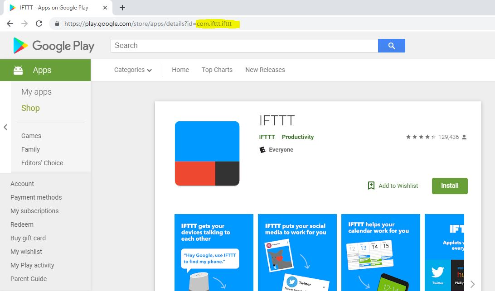

## IoT App Search
This script will download, decompile, and search through android IoT apps for vulnerabilites. Given an app ID, it will search through the app for specified strings in the config.txt file. Once found it will output the resulting matches in an output text file named after the app ID. 

### How to use
First get the app ID of the app you want to check. The app ID can be found in the URL on the google play store page, following the id= parameter. For example : 

Then take the app Id and run the command below (ensure python is installed) : 
```
python main.py com.example.app.id
```

If you wish to use only certain aspects of the script, you can specify parameters at the end to skip cetrain steps. Specify a 1 as the last parameter to only download the app, or specify a 2 as the last parameter to only unpackage and scan an already downloaded apk.

#### Download only example
```
python main.py com.example.app.id 1
```
#### Decompile and scan only example
```
python main.py com.example.app.id 2
```
#### config.txt example
Specify which terms you would like to search for in the config.txt file. If you want to look for strings of a specific length (lets say, to look for an uninterrupted string of random letters or numbers that is 32 characters long, which describes what an oAuth secret key would look like) you would start the string with *!* and then specify how many characters long the string you want to search for must be. A sample config.txt file would look something like this
```
secret
client_ID
!32
oAuth
```